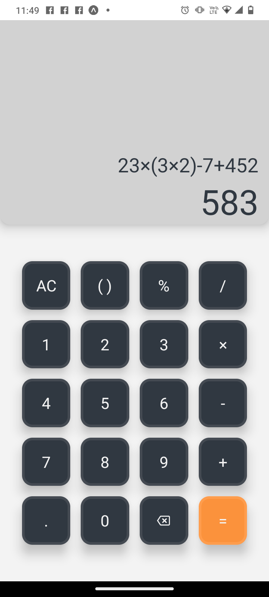

# Calc 

Calc is a simple calculator app built using React Native. This app was created for learning purposes and may contain room for further enhancements.
You can download my app from https://drive.google.com/file/d/1WKfbfvni-cK49BFSyz62_F_eAQjfpgJz/view?usp=sharing

## Features

- Perform basic arithmetic operations (addition, subtraction, multiplication, division).
- Handle brackets and percentages.
- Clear the calculator display.
- Backspace to remove the last character.
- Calculate and display results.
  
## Screenshot

   
  
 

## Getting Started

Follow these steps to run the app locally:

1. Clone the repository:
2. Install dependencies:
3.  Run the app: 'Npm start'
4. Use an emulator or scan the QR code to run the app on your device with Expo Go.

## What I've Learned

- Styling the UI using Tailwind CSS.
- Implementing basic arithmetic operations and mathematical calculations.
- Using state management and context to manage calculator data.
- Handling user interactions and button clicks.
- Implementing error handling for scenarios like division by zero.
- Integrating third-party libraries like math.js for advanced calculations.

## Technologies Used

- React Native
- math.js
- Expo

- ## License

This project is licensed under the MIT License 
